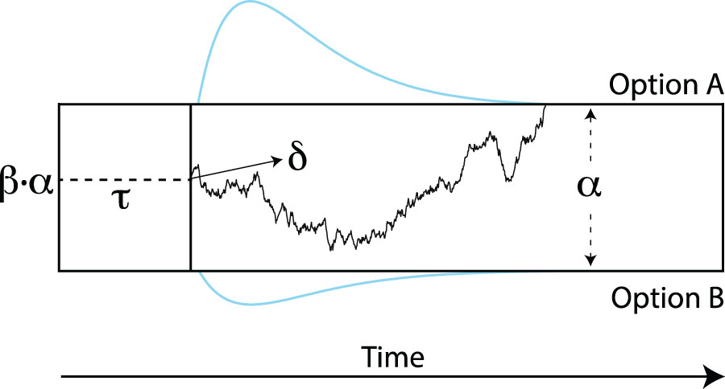

## Information



#### Functions:

    -   `dwiener`: density function to compute the probability density
        function (PDF) at a given quantile at a given parameter set
    -   `pwiener`: probability function to compute the cumulative
        distribution (CDF) at a given quantile for a given parameter set
    -   `qwiener`: the inverse CDF function to compute the quantile at a
        give p-value
    -   `rwiener`: random number generator (RNG) to generate random
        samples for a given parameter set
    -   `nlm` or `optim`: to estimate the model parameters for an
        observed data set
        

#### Use of the typical diffusion model with 4 parameters:

    -   α (boundary separation): Speed-accuracy trade-off (high α means
        high accuracy)
    -   𝜏 (non-decision time): Motor response time, encoding time (high
        means slow encoding, execution)
    -   β (initial bias): Bias for either response (β \> 0.5 means bias
        towards response 'A')
    -   δ (drift rate parameter): Quality of the stimulus (close to 0
        means ambiguous stimulus)
        

#### Key information on the Maximum likelihood estimation method using RWiener

    -   Computational tractability = moderate
    -   Sample size required = Can be used with as few as about 40-50
        trials per subject, at least 10 trials per condition
    -   Outlier RTs = Very sensitive to outlier RTs (especially fast
        RTs)

```{r}
# installs
#install.packages(c("RWiener", "tidyverse", "jtools", "gridExtra", "rempsyc", "rempsyc", "effectsize"))

# imports
library(RWiener)
library(tidyverse)
library(patchwork)
library(jtools)
library(gridExtra)
library(rempsyc)
library(effectsize)
```

### Define the dataset and parameters of the DDM

Parameters:

-   n = 100 observations
-   alpha = boundary seperation
-   tau = non-decision time
-   beta = bias
-   delta = drift rate
-   The created `dat` object is a dataframe with n observations and two
    variables: `dat$q` contains the RTs, whereas `dat$resp` contains a
    factor to indicate the response made (upper vs. lower)

```{r}
# Set the seed and generate data
set.seed(0)

# Define the number of subje
n_obs = 100
dat <- rwiener(n=n_obs, alpha=2, tau=.3, beta=.5, delta=.5)
head(dat)
```

### `d-Wiener` function

-   This function takes seven arguments, the first argument is the RT at
    which the density shall be evaluated, the next four arguments are
    the model parameters α, τ, β, and δ.
-   resp takes any of three valid values: upper, lower, or both, meaning
    that the function shall return the density at the given quantile for
    the upper boundary, the lower boundary or the sum of both densities
    together, respectively.
-   resp takes any of three valid values: upper, lower, or both, meaning
    that the function shall return the density at the given quantile for
    the upper boundary, the lower boundary or the sum of both densities
    together, respectively. Its default value is set to upper.
-   give_log that takes TRUE or FALSE as values and is set to FALSE as a
    default. When this argument is TRUE, the function will return the
    logarithm of the density instead of the density itself.

```{r}
# Set up the x values
x <- seq(0, 3, by = 0.01)

# Create the plot for the "upper" response
curve(dwiener(x, 2, .3, .5, .5, rep("upper", length(x))), xlim=c(0,3), ylim=c(0, 1), 
      main="Density of responses", ylab="Density", xlab="RT", col="blue")

# Add the "lower" response to the plot
curve(dwiener(x, 2, .3, .5, .5, rep("lower", length(x))), add=TRUE, col="red")

# Add a legend
legend("topright", legend=c("Upper", "Lower"), col=c("blue", "red"), lty=1)
```

### `p-Wiener` function

-   To calculate the cumulative distribution, we can use the CDF
    function pwiener as follows
-   The arguments are the same as for the previously described function,
    without the give_log argument.

```{r}
# Draw curve plots for 
upper <- curve(pwiener(x, 2, .3, .5, .5, 
              rep("upper",
              length(x))), 
              xlim=c(0,3),
              main="Cumulative Distribution of responses",
              ylab="density",
              xlab="quantile",
              col="blue")

lower <- curve(pwiener(x, 2, .3, .5, .5, 
              rep("lower", length(x))), add=TRUE, col="red")
# Add a legend
legend("topright", legend=c("Upper", "Lower"), col=c("blue", "red"), lty=1)

```

### `q-Wiener` function

-   We can also find the appropriate quantile for a given probability
    via the inverse CDF function
-   Te first argument needs to be a probability, indicating the
    CDF-value to be looked up.

```{r}
# lookup of the .2 quantile for the CDF of the lower boundary
qwiener(p=.2, alpha=2, tau=.3, beta=.5, delta=.5, resp="lower")
```

### Plot-function

-   This function `wiener_plot()` draws the observed lower and upper
    responses

```{r}
wiener_plot(dat)
```

------------------------------------------------------------------------

# Model fitting

-   2 different algorithms --\>They estimate similar parameters

-   c(1, 0.1, 0.1, 1) --\> Starting point

```{r}
# using optim, first with Nelder-Mead algorithm, then with BFGS
optim1 <- optim(c(1, .1, .1, 1), wiener_deviance, dat=dat, method="Nelder-Mead")
est <- optim(optim1[["par"]], wiener_deviance, dat=dat, method="BFGS", hessian=TRUE)

#Extract the parameters
# [alpha, tau, beta, delta]
est$par

# using nlm, which uses a Newton-type algorithm
nlm1 <- nlm(p=c(1, .1, .1, 1), f=wiener_deviance, dat=dat)

# Extract the parameters
nlm1$estimate
```

-   Estimation of DDM-Params using Nelder-Mead or Newton-type algorithms
    are very similiar

### Compare model vs. real data 1

```{r}
set.seed(43)
# Create modeled data
model_dat <- rwiener(n=n_subs, alpha=est$par[1], tau=est$par[2], beta=est$par[3], delta=est$par[4])

# Create data frames
df_real <- data.frame(value = dat, group = "Real")
df_model <- data.frame(value = model_dat, group = "Model")

# Combine the data frames
df_comparison <- rbind(df_real, df_model)

# Use ggplot2 to plot the data
upper_density <- ggplot(df_comparison %>% filter(value.resp == "upper"), aes(x = value.q, fill = group)) +
          geom_density(alpha = 0.4) +
          labs(x = "RT", y = "Density", title = "Comparison of Real and Model Data Distributions") +
          scale_fill_manual(values = c("Real" = "blue", "Model" = "red")) +
          theme_apa()


# Use ggplot2 to plot the data
lower_density <- ggplot(df_comparison %>% filter(value.resp == "lower"), aes(x = value.q, fill = group)) +
          geom_density(alpha = 0.4) +
          labs(x = "RT", y = "Density", title = "Comparison of Real and Model Data Distributions") +
          scale_fill_manual(values = c("Real" = "blue", "Model" = "red")) +
          theme_apa()


upper_density/lower_density
```

### Compare model vs. real data 2

```{r}
# Line Diagrams
# Create data frames
df_real <- data.frame(value = dat, group = "Real")
df_model <- data.frame(value = model_dat, group = "Model")

# Combine the data frames
df_comparison <- rbind(df_real, df_model)

# Upper responses Density 
upper_curve <- ggplot(df_comparison %>% filter(value.resp == "upper"), aes(x = value.q)) +
          geom_line(aes(color = group), stat = "density", position = "identity", linewidth = 1.5) +
          labs(x = "RT", y = "Density", title = "Response (upper)") +
          scale_color_manual(values = c("Real" = "blue", "Model" = "red")) +
          theme_apa() +
          theme(legend.justification = c(1, 1), legend.position = c(1, 1), plot.title = element_text(hjust = 0.1), legend.box.margin = margin(6, 6, 6, 6), legend.background = element_rect(colour = "black")) +
          ylim(0,1)

# Lower responses Density
lower_curve <- ggplot(df_comparison %>% filter(value.resp == "lower"), aes(x = value.q)) +
          geom_line(aes(color = group), stat = "density", position = "identity", linewidth = 1.5) +
          labs(x = "RT", y = "Density", title = "Response (lower)") +
          scale_color_manual(values = c("Real" = "blue", "Model" = "red")) +
          theme_apa() +
          theme(legend.justification = c(1, 1), legend.position = c(1, 1), plot.title = element_text(hjust = 0.1), legend.box.margin = margin(6, 6, 6, 6), legend.background = element_rect(colour = "black")) +
          ylim(0,1)

# Calculate accuracy for each group
df_comparison$correct <- ifelse(df_comparison$value.resp == "upper", 1, 0)
accuracy <- df_comparison %>% group_by(group) %>% summarise(Accuracy = (sum(correct)))

# Create Barplot
accuracy_plot <- ggplot(accuracy, aes(x=group, y=Accuracy)) +
    geom_bar(stat="identity", position=position_dodge()) +
    labs(x = "Group", y = "Percent Correct", title = "ACCURACY") +
    scale_fill_manual(values = c("blue","red")) +
    theme_apa() +
    theme(legend.justification = c(1, 1), legend.position = c(1, 1), plot.title = element_text(hjust = 0.5), legend.box.margin = margin(6, 6, 6, 6))


# Call plots
accuracy_plot
(upper_curve+lower_curve) + plot_layout(widths = c(2, 2))
accuracy
df_comparison
```

### Correlation of Reaction Times

```{r}
# Correlation of RTs
cor(df_real$value.q, df_model$value.q, method = "pearson")
```

### Criteria

-   wiener_likelihood(x=x, dat=dat)

    -   calculates the logarithm l of the likelihood for given parameter
        values and data;

-   wiener_deviance(x=x, dat=dat)

    -   calculates the model deviance −2l

-   wiener_aic(x=x, dat=dat)

    -   calculates the model AIC (Akaike's Information Criterion) −2l +
        8;

-   wiener_bic(x=x, dat=dat)

    -   calculates the model BIC (Bayesian Information Criterion) −2l +
        4 ln(N).

    ```{r}
    # Estimate different estimation parameters
    # vector containing the four parameter values of the model in the order: α, τ, β, δ.
    wiener_likelihood(x=est$par, dat=dat)
    wiener_deviance(x=est$par, dat=dat)
    wiener_aic(x=est$par, dat=dat)
    wiener_bic(x=est$par, dat=dat)
    ```

------------------------------------------------------------------------

# Full Analysis Pipeline

------------------------------------------------------------------------

## Pipeline Part 1: Parameter Estimation for each participant

-   **Data Generation**:

    -   Initializing settings and generating individual subject data
        using the **`rwiener`** function, then aggregating all into a
        single dataframe.

-   **Parameter Estimation**:

    -   Defining a function (**`estimate_parameters`**) to estimate data
        parameters using optimization methods, and then applying this
        function to each subject's data.

-   **Results Compilation**:

    -   Aggregating individual parameter estimates into a dataframe and
        computing the mean across all subjects, followed by displaying
        the results.

```{r}
# 1. Load in the data
set.seed(0)

n_subs <- 100
n_trials <- 32
all_data <- vector("list", n_subs)

for (i_sub in 1:n_subs) {
  all_data[[i_sub]] <- 
    data.frame(
      subject = i_sub, 
      rwiener(n = n_trials, alpha = 2, tau = .3, beta = .5, delta = .5)
      )
}

all_data <- do.call(rbind, all_data)


# 1.2. Parameter estimation
# Parameter estimation function
estimate_parameters <- function(data) {
  # Remove the 'subject' column
  data <- data[, -which(names(data) %in% "subject")]
  
  #Estimate parameters 
  optim1 <- optim(c(1, .1, .1, 1), wiener_deviance, dat=data, method="Nelder-Mead", control=list(maxit=100000))
  est <- optim(optim1[["par"]], wiener_deviance, dat=data, method="BFGS", hessian=TRUE, control=list(maxit=100000))
  est$par
  
  ## Or use this optim function instead
  #nlm1 <- nlm(p=c(1, .1, .1, 1), f=wiener_deviance, dat=dat, iterlim = 1000)
  #nlm1$estimate
}

# Calculate the parameters for each subject and store them in a list
params_list <- lapply(split(all_data, all_data$subject), estimate_parameters)

# Convert the list to a data frame
params_df <- do.call(rbind, params_list)

# Calculate the mean across subjects
mean_params <- colMeans(params_df)

# Show params_df and mean params
params_df
cat("the Mean parameters are: ", mean_params,"\n",sep="\t")
```

## Pipeline 2: Get Estimation parameters

-   **Wiener Likelihood:** The probability of the observed data under
    the current parameters of the Wiener model.
-   **Wiener Deviance:** A measure of the discrepancy between observed
    data and predictions made by the Wiener model.
-   **Wiener AIC:** A score that balances model fit and complexity, used
    to compare different Wiener models.
-   **Wiener BIC:** Similar to AIC, but places a heavier penalty on
    model complexity.

```{r}
# Function to create plots for each subject
create_estimation_dataframes <- function(all_data, params_df) {
  
  # Get the unique subjects
  subjects <- unique(all_data$subject)
  
  # Initialize an empty data frame to store results
  estimation_df <- data.frame()
  
  # Loop over each subject
  for (subject in subjects) {
    # Get the parameters for the current subject
    params <- params_df[subject, ]
    
    # Extract real data for current subject
    real_data <- all_data[all_data$subject == subject, ]
    
    # Drop 'subject' column
    real_data <- real_data[, -which(names(real_data) %in% "subject")]
    
    # Get estimation params
    w_likelihood  <- wiener_likelihood(x=params, dat=real_data)
    w_deviance    <- wiener_deviance(x=params, dat=real_data)
    w_aic         <- wiener_aic(x=params, dat=real_data)
    w_bic         <- wiener_bic(x=params, dat=real_data)
    
    # Add to the results data frame
    estimation_df <- rbind(estimation_df, data.frame(
      subject = subject,
      alpha = params[1],
      tau = params[2],
      beta = params[3],
      delta = params[4],
      likelihood = w_likelihood,
      deviance = w_deviance,
      aic = w_aic,
      bic = w_bic
    ))
  }
  
  # Return the results data frame
  return(estimation_df)
}

# Use the function
estimation_df <- create_estimation_dataframes(all_data, params_df)
nice_table(estimation_df)
```

## Pipeline Part 3: Generate modeled data

-   **Data Modeling**:

    -   Using parameters from **`params_df`**, modeled data for each
        subject is generated with the **`rwiener`** function and stored
        in individual dataframes.

-   **Data Aggregation**:

    -   All individual dataframes of modeled data are combined into one
        unified dataframe called **`modeled_data`**, and the first few
        rows are displayed using the **`head`** function.

```{r}
# Generate modeled data
### Initialize an empty list to store the modeled data for each subject
modeled_data_list <- list()

### For loop to iterate through each subject
for (i in 1:nrow(params_df)) {
  # Extract parameters for the each subject
  params <- params_df[i, ]
  
  # Count number of trials for the each participant
  n_trials <- nrow(all_data[all_data$subject == i, ])
  
  # Generate modeled data for the each participant using the rwiener function
  modeled_data <- rwiener(n = n_trials, alpha = params[1], tau = params[2], beta = params[3], delta = params[4])
  
  # Create dataframe with the modeled data and subject number
  modeled_df <- data.frame(subject = i, q = modeled_data)
  
  # Append the dataframe to list
  modeled_data_list[[i]] <- modeled_df
}

### Combine the dataframs in the list into a single dataframe
modeled_data <- do.call(rbind, modeled_data_list)
head(modeled_data)
```

## Pipeline 4: Compare modeled and real data

-   **Model Data Creation**:

    -   Modeled data is generated for each of the 100 subjects using
        mean parameters and the **`rwiener`** function, then labeled as
        "Model", and combined with the real data labeled as "Real" into
        a single dataframe called **`total`**.

-   **Visualization**:

    -   A function **`create_density_plots`** is defined to create
        density plots comparing reaction times (RT) of real and modeled
        data for each subject's upper and lower responses. The plots are
        generated using the **`ggplot2`** package with distinct colors
        for real and model data, and stored in a list named **`plots`**.

```{r}
## Compare model vs. real data
n_subs <- 100
n_trials <- 32
all_modeled_data <- vector("list", n_subs)

for (i_sub in 1:n_subs) {
  all_modeled_data[[i_sub]] <- 
    data.frame(
      subject = i_sub, 
      rwiener(n = n_trials, 
              alpha = mean_params[1], 
              tau = mean_params[2], 
              beta = mean_params[3], 
              delta = mean_params[4])
      )
}

all_modeled_data <- do.call(rbind, all_modeled_data)

# Create a group variabe and merge them
all_modeled_data$group  = "Model"
all_data$group = "Real"

# Combine the data frames
total <- rbind(all_modeled_data, all_data)

create_density_plots <- function(total) {
  
  # Get the unique subjects
  subjects <- unique(total$subject)
  
  # Create a list to store plots
  plots <- list()
  
  # Loop over each subject
  for (i in seq_along(subjects)) {
    
    # For upper responses
    p1 <- ggplot(total %>% filter(subject == subjects[i] & resp == "upper"), aes(x = q)) +
              geom_line(aes(color = group), stat = "density", position = "identity", linewidth = 1.5) +
              labs(x = "RT", y = "Density", title = paste("Subject", subjects[i], "Response (upper)")) +
              scale_color_manual(values = c("Real" = "blue", "Model" = "red")) +
              theme_apa() +
              theme(legend.justification = c(1, 1), legend.position = c(1, 1), plot.title = element_text(hjust = 0.1), legend.box.margin = margin(6, 6, 6, 6), legend.background = element_rect(colour = "black")) +
              ylim(0,1)
    
    # For lower responses
    p2 <- ggplot(total %>% filter(subject == subjects[i] & resp == "lower"), aes(x = q)) +
              geom_line(aes(color = group), stat = "density", position = "identity", linewidth = 1.5) +
              labs(x = "RT", y = "Density", title = paste("Subject", subjects[i], "Response (lower)")) +
              scale_color_manual(values = c("Real" = "blue", "Model" = "red")) +
              theme_apa() +
              theme(legend.justification = c(1, 1), legend.position = c(1, 1), plot.title = element_text(hjust = 0.1), legend.box.margin = margin(6, 6, 6, 6), legend.background = element_rect(colour = "black")) +
              ylim(0,1)
    
    # Print the plots
    print(p1)
    print(p2)
    
    # Store the plots in the list
    plots[[paste("Subject", subjects[i], "upper")]] <- p1
    plots[[paste("Subject", subjects[i], "lower")]] <- p2
  }
  
  return(plots)
}

# Use the function
plots <- create_density_plots(total)
```

## Mean Parameters of Model vs Real Data

-   Using the **`ggplot2`** package, two density plots are created to
    compare reaction times (RT) of real vs. modeled data for both upper
    and lower responses, each distinctly colored and themed with APA
    styling.

```{r}
# For upper responses
ggplot(total %>% filter(resp == "upper"), aes(x = q)) +
      geom_line(aes(color = group), stat = "density", position = "identity", linewidth = 1.5) +
      labs(x = "RT", y = "Density",  title = "Response (upper)") +
      scale_color_manual(values = c("Real" = "blue", "Model" = "red")) +
      theme_apa() +
      theme(legend.justification = c(1, 1), legend.position = c(1, 1), plot.title = element_text(hjust = 0.1), legend.box.margin = margin(6, 6, 6, 6), legend.background = element_rect(colour = "black")) +
              ylim(0,1)
    
# For lower responses
ggplot(total %>% filter(resp == "lower"), aes(x = q)) +
              geom_line(aes(color = group), stat = "density", position = "identity", linewidth = 1.5) +
              labs(x = "RT", y = "Density",  title = "Response (lower)") +
              scale_color_manual(values = c("Real" = "blue", "Model" = "red")) +
              theme_apa() +
              theme(legend.justification = c(1, 1), legend.position = c(1, 1), plot.title = element_text(hjust = 0.1), legend.box.margin = margin(6, 6, 6, 6), legend.background = element_rect(colour = "black")) +
              ylim(0,1)
    
```
